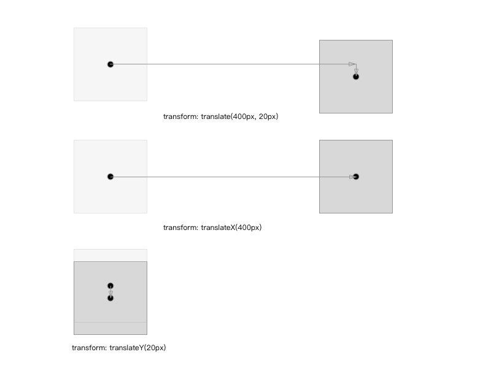
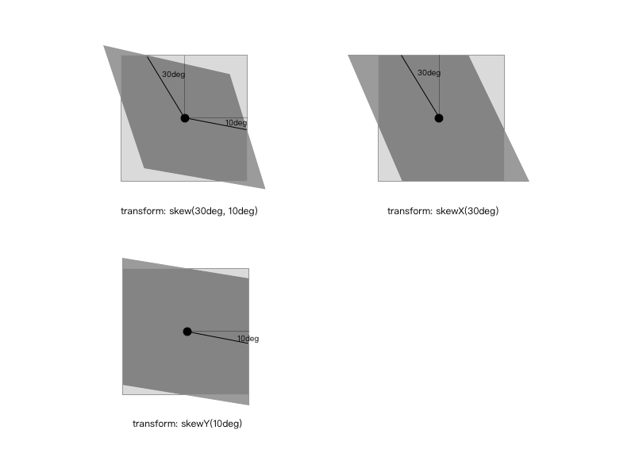

# CSS3 动画
在 CSS3 出现之前，动画都是通过 JavaScript 动态的改变元素的样式属性来完成了，这种方式虽然能够实现动画，但是在性能上存在一些问题。CSS3 的出现，让动画变得更加容易，性能也更加好。
CSS3 中有三个关于动画的样式属性`transform`、`transition`和`animation`；

## transform
`transform`可以用来设置元素的形状改变，主要有以下几种变形：`rotate`（旋转）、`scale`（缩放）、`skew`（扭曲）、`translate`（移动）和`matrix`（矩阵变形），语法如下：

```
.transform-class {
	transform ： none | <transform-function> [ <transform-function> ]*
}
```

`none`表示不做变换；`<transform-function>`表示一个或多个变化函数，变化函数由函数名和参数组成，参数包含在`()`里面，用**空格**分开，例如：

```
.transform-class {
	transform ： rotate(30deg) scale(2,3);
}
```

### transform-origin 基点
所有的变形都是基于基点，基点默认为元素的中心点。用法：`transform-origin: (x, y)`，其中 x 和 y 的值可以是百分比、rem 或者是 px 等等，也可以用表示位置的单词来表示例如：x 可以用`left`、`center`、`right`；y 可以用`top`、`center`、`bottom`。

```
.transform-class {
	transform-origin: (left, bottom);
}
```

### rotate 旋转
用法：`rotate(<angle>)`；表示通过指定的角度对元素进行旋转变形，如果是正数则顺时针旋转，如果是负数则逆时针旋转，例如：

```
.transform-rotate {
	transform: rotate(30deg);
}
```


### scale 缩放
它有三种用法：`scale(<number>[, <number>])`、`scaleX(<number>)`和`scaleY(<number>)`；分别代表水平和垂直方向同时缩放、水平方向的缩放以及垂直方向的缩放，入参代表水平或者垂直方向的缩放比例。缩放比例如果大于1则放大，反之则缩小，如果等于1代表原始大小。

```
.transform-scale {
	transform: scale(2,1.5);
}

.transform-scaleX {
	transform: scaleX(2);
}

.transform-scaleY {
	transform: scaleY(1.5);
}
```


### translate 移动
移动也分三种情况：`translate(<translation-value>[, <translation-value>])`、`translateX(<translation-value>)`和`translateY(<translation-value>)`；分别代表水平和垂直的移动、水平方向的移动以及垂直方向同时移动，移动单位是 CSS 中的长度单位：`px`、`rem`等;

```
.transform-translate {
	transform: translate(400px, 20px);
}

.transform-translateX {
	transform: translateX(300px);
}

.transform-translateY {
	transform: translateY(20px);
}
```



### skew 扭曲
扭曲同样也有三种情况，`skew(<angle>[, <angle>])`、`skewX(<angle>)`和`skewY(<angle>)`；同样也是水平和垂直方向同时扭曲、水平方向的扭曲以及垂直方向的扭曲，单位为角度。

```
.transform-skew {
	transform: skew(30deg, 10deg);
}

.transform-skewX {
	transform: skewX(30deg);
}

.transform-skewY {
	transform: skewY(10deg);
}
```


### matrix
矩阵变形相对来说非常复杂，涉及到数学中的矩阵计算，有兴趣的同学可以研究一下：[CSS3 Transform Matrix](http://www.tuicool.com/articles/na6jy2)


