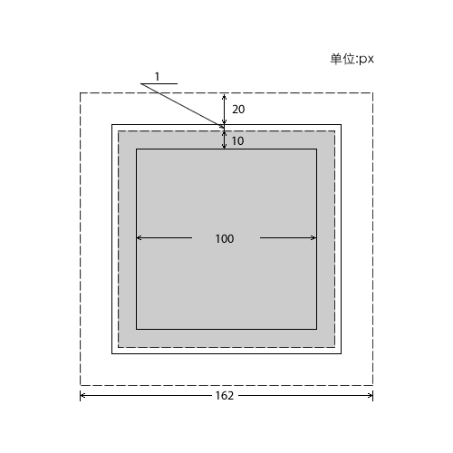
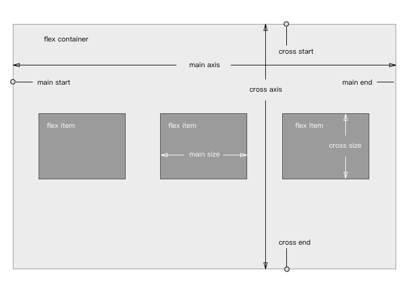
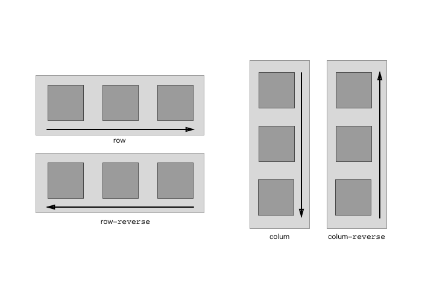
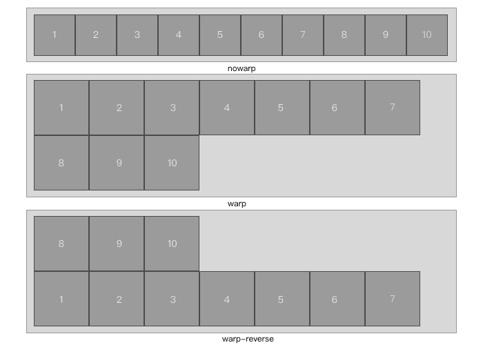
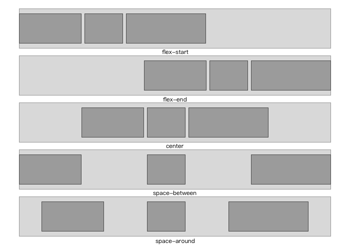
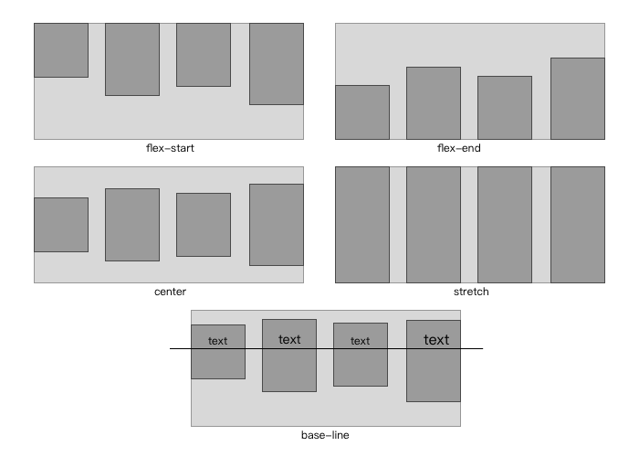

# CSS 盒模型 vs Flex 布局
CSS 盒模型是网页设计的布局中进场用到的模型，很好的了解模型对网页的布局有非常大的帮助；CSS3 让网页能够符合多种平台，让网页更加的弹性推出了 Flex 布局。

## 盒模型
盒模型一直在网页设计中非常流行，现在的前端工程师对盒模型的了解程度越来越高，我们在重新回顾一下盒模型的精髓：

```
//CSS
.box {
	height: 100px;
	width: 100px;
	margin: 20px;
	padding: 10px;
	border: 1px solid #000;
	background-color: #ccc;
}
```


当然不同的 desplay 属性下的盒模型是不一样的，上图为`desplay:block`情况下的盒模型，当在`desplay:inline`、`desplay:table-cell`等情况下需要另外考虑。

## flex
CSS3 新增了`desplay:flex`，它使得网页更加弹性适合各种不同的屏幕，它的思想是让容器有能力让其子项目能够改变其宽度、高度甚至是顺序，以最佳的方式填充可用空间，当然这种不可预知的布局会让页面缺乏灵活性。

### 概念
设置了`desplay:flex`的元素称为**弹性容器**，它的所有子元素将称为`flex item`（弹性项目）。**注意：设置了 `flex` 布局以后，子元素的`float`、`clear`和`vertical-align`属性将失败。**

* **main axis**：水平轴主轴
* **cross axis**：垂直交叉轴
* **main start**：主轴的开始位置
* **main end**：主轴的结束位置
* **cross start**：交叉轴的开始位置
* **cross end**：交叉轴的结束位置
* **main size**：单个弹性项目占据的主轴
* **cross size**：单个弹性项目占据的交叉轴

### 容器的属性

* flex-direction
* flex-wrap
* flex-flow
* justify-content
* align-items
* align-content

#### flex-direction
它决定了主轴的方向，就是弹性项目的方向

```
.box {
	flex-direction: row | row-reverse | column | column-reverse;
}
```


#### flex-wrap
它来设置项目如何换行，默认情况下项目都在一条轴线上

```
.box {
	flex-wrap: nowrap | wrap | wrap-reverse;
}
```

#### flex-flow
它是`flex-direction`和`flex-wrap`的简写，默认值为：`row nowrap`

```
.box {
  flex-flow: <flex-direction> || <flex-wrap>;
}
```
#### justify-content
它来设置项目在主轴上的对齐方式

```
.box {
	justify-content: flex-start | flex-end | center | space-between | space-around;
}
```

#### align-items
它来设置项目在交叉轴上的对齐方式

```
.box {
	align-items: flex-start | flex-end | center | baseline | stretch;
}
```

#### align-content
它定义了多根轴线的对齐方式。如果项目只有一根轴线，该属性不起作用。

```
.box {
  align-content: flex-start | flex-end | center | space-between | space-around | stretch;
}
```

### 弹性项目的属性

* order
* flex-grow
* flex-shrink
* flex-basis
* flex
* align-self

#### order
它是用来定义项目的排列顺序，数字越小，排列靠前，默认为0。

```
.item {
  order: <integer>;
}
```

#### flex-grow
这个属性是用来设置项目的放大比例，默认为0，即如果存在剩余空间也不放大；如果说有的项目的`flex-grow`属性都为1，那么它们会均分剩余的空间，如果一个项目的`flex-grow`属性为2，其他项目都为1，则为2的占据的剩余空间将比其他项多一倍。

#### flex-shrink

#### flex-basis

#### flex

#### align-self


